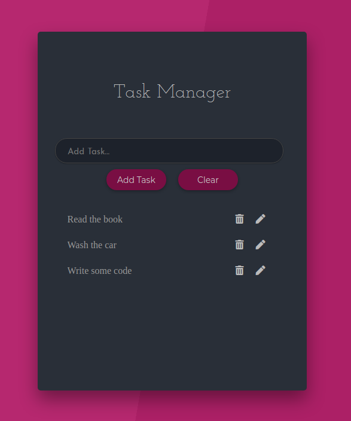

# React Task Manager App

React App with Context API and React Hooks.

<p align="center">
  
</p>

## Quick Start

First of all, install the dependencies to run this app.

- [NodeJS](http://nodejs.org/)
- [Yarn](https://yarnpkg.com/lang/en/docs/cli/install/)

```bash
# Clone this repository
$ git clone git@github.com:brenopolanski/react-task-manager-app.git

# Install dependencies
$ yarn install

# Run app
$ yarn start
```
